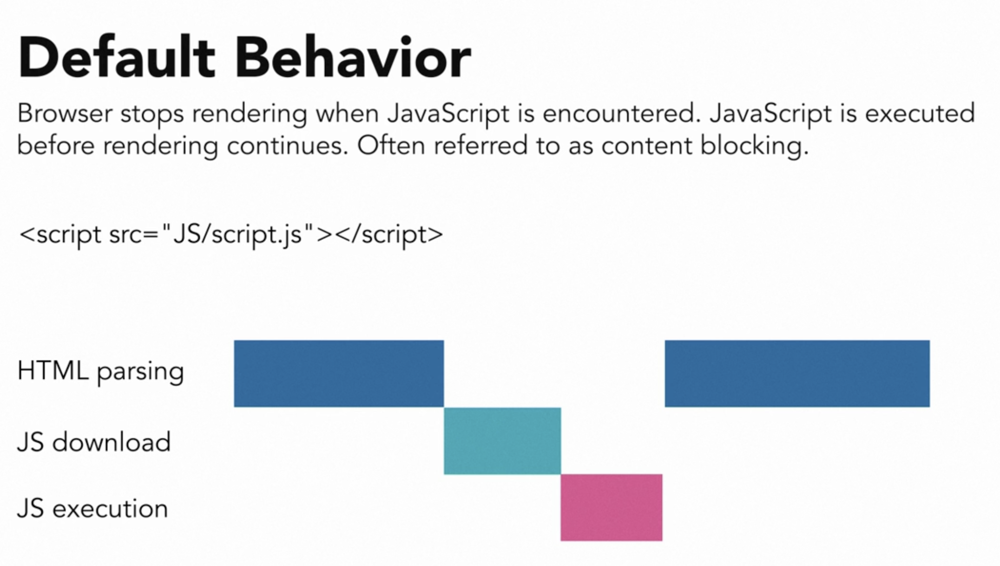
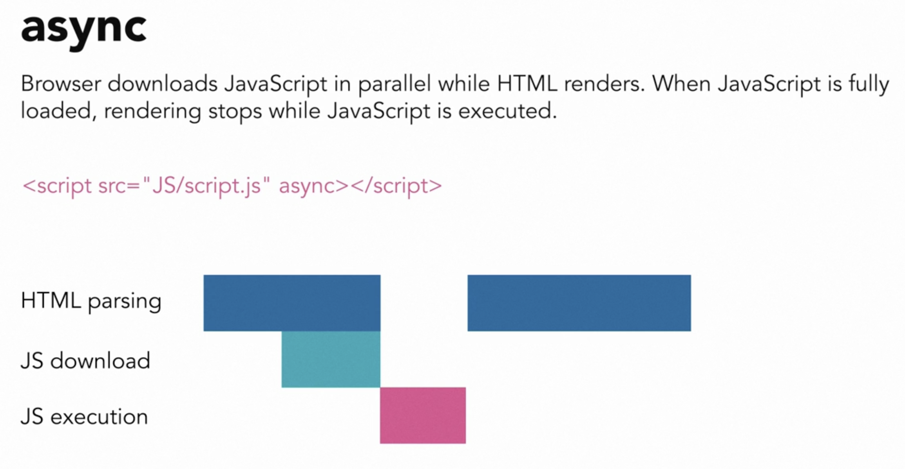
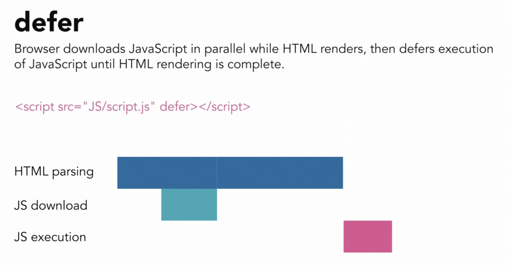

# Here are the key takeaways from the "Modern JavaScript loading" video:

**- Traditional Loading Issues:** Loading JavaScript traditionally can cause render-blocking issues, where the browser stops parsing HTML to fetch and execute JavaScript files, slowing down page load times.

**- Async Keyword:** The `async` keyword allows the browser to continue parsing HTML while downloading the JavaScript file, only stopping to execute the script once it's fully downloaded. This reduces render-blocking time.

**- Defer Keyword:** The `defer` keyword ensures that JavaScript is executed only after the entire HTML document is parsed, preventing errors related to elements not being rendered yet. This is recommended for most cases.

These points help optimize JavaScript loading for better performance and reliability.
