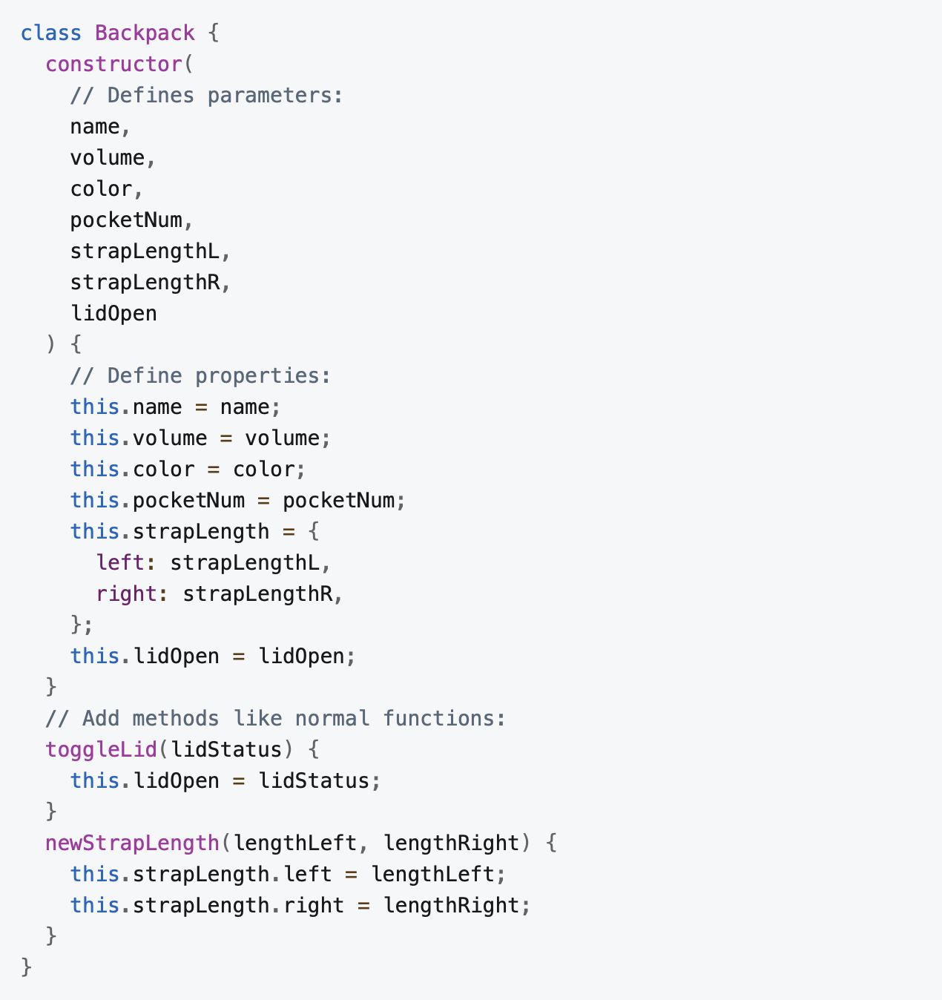
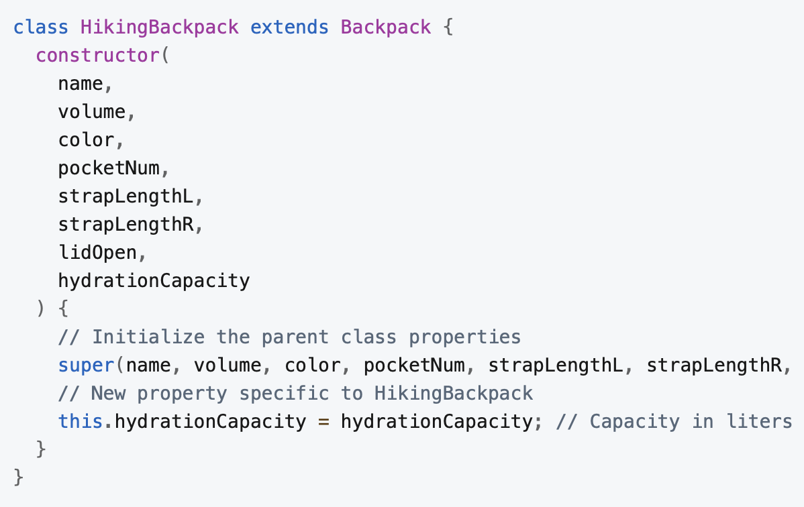
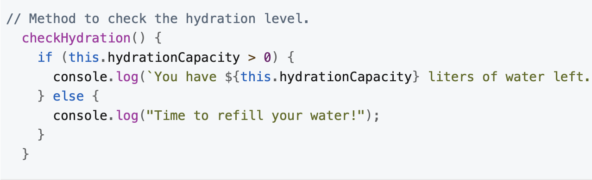

# Summary

**- Class Extension:** You can create a new class based on an existing class using the `extends` keyword, inheriting all properties and methods of the existing class.

**- Adding New Features:** The new class can have additional properties and methods specific to its needs, beyond what is inherited from the parent class.

**- Using `super()`:** The `super()` method is used to call the constructor of the parent class, ensuring the inherited properties are initialized correctly.

These points will help you understand how to extend existing classes to create more specialized and feature-rich objects in JavaScript.

# Full Article

One of the powerful features of classes is they can be extended. You can create a new class based on an existing class, and this new class will not only inherit all the properties and methods of the existing class, but you can add new properties and methods to the new class.

This is useful when you have a class that works for most situations, but there are some cases where you need to add new features. Instead of starting from scratch and creating an entirely new class, you can extend the existing class and add the new features. A classic example of this is making a main class called MotorVehicle with properties and methods that are common to all motor vehicles, then extending this class with more specific classes like Car, Truck, and Motorcycle.

Earlier in the course you worked with the Backpack class which has properties and methods that apply to all backpacks. But there's a snag: In my closet I have a hiking backpack with an extra feature that isn't covered by the Backpack class—a hydration pack. For my dataset to be complete, I need the ability to track the hydration capacity of my pack, for obvious reasons. The bigger the hydration capacity, the heavier the pack can potentially get at the start of a hike.

To solve this problem, let's create a new class called HikingBackpack by extending the Backpack class.

Here's the original Backpack class for reference:



To create a new class from an existing one, use the `extends` keyword followed by the name of the class you want to extend:


Next, define all the properties the class needs in the constructor. This includes both the existing properties from the parent class and any new properties you want to add:



In the above example, you see hydrationCapacity has been added in the constructor. This is the new property specific to the HikingBackpack class. The super() method is used to call the constructor of the parent class and pass in the properties common to both classes. Finally, the new hydrationCapacity property is added.

The new HikingBackpack class can also be extended with new methods. That's done the same way as before:



You can also override methods from the parent class by defining a new method with the same name, calling in the parent method with the super keyword, and then adding new functionality:

```
toggleLid(lidStatus) {
    super.toggleLid(lidStatus); // Call the parent method
    if (lidStatus) {
      console.log("Your hiking backpack lid is open. Remember to check to make sure the hydration pack is inserted.");
    } else {
      console.log("Your hiking backpack lid is closed. Remember to check to make sure the hydration pack is inserted.");
    }
  }
```

Here's the full code for the extended HikingBackpack class:

```
class HikingBackpack extends Backpack {
  constructor(
    name,
    volume,
    color,
    pocketNum,
    strapLengthL,
    strapLengthR,
    lidOpen,
    hydrationCapacity
  ) {
    // Initialize the parent class properties
    super(name, volume, color, pocketNum, strapLengthL, strapLengthR, lidOpen);
    // New property specific to HikingBackpack
    this.hydrationCapacity = hydrationCapacity; // Capacity in liters
  }

  // Method to check the hydration level and alert if it needs refilling
  checkHydration() {
    if (this.hydrationCapacity > 0) {
      console.log(`You have ${this.hydrationCapacity} liters of water left.`);
    } else {
      console.log("Time to refill your water!");
    }
  }

  // Extend or override methods from the parent class if necessary
  // For example, adding extra functionality when the lid is toggled
  toggleLid(lidStatus) {
    super.toggleLid(lidStatus); // Call the parent method
    if (lidStatus) {
      console.log(
        "Your hiking backpack lid is open. Remember to check to make sure the hydration pack is inserted."
      );
    } else {
      console.log(
        "Your hiking backpack lid is closed. Remember to check to make sure the hydration pack is inserted."
      );
    }
  }
}
```
