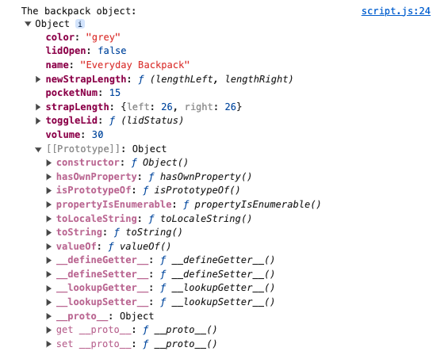

# Summary

**- Prototype Object:** Every object in JavaScript is based on a prototype object, which serves as a template.

**- Prototype Chain:** Objects inherit properties and methods from their prototype, creating a chain up to the core Object.prototype.

**- Inheritance:** Objects can inherit built-in properties and methods, and you can override these properties and methods or add new ones.

These points will help you understand how prototype inheritance works in JavaScript and how it affects object behavior.

# Full Article

Consider this simplified version of the backpack object:

```
const backpack = {

  name: "Everyday Backpack",

  volume: 30,

};
```

How does JavaScript know how to turn this code into an object? By using a template, every object in JavaScript is based on a prototype object, a template built into JavaScript itself. That prototype becomes part of every object you make, and you can find it as a hidden property called `[[Prototype]]`.

Inspect the object in the console and you can inspect the prototype:



For an object literal like this ("object literal" meaning it's created with curly braces `{}` rather than using an object constructor which is covered later in the course), the prototype can be accessed using `Object.prototype`. This is the core prototype for all objects created with object literals or the `Object()` constructor and it's the first link of the prototype chain (unless you explicitly set another prototype).

This is what's referred to as "prototype inheritance" in JavaScript. Every object you work with inherits its structure from another prototype object, all the way up to the core `Object.prototype`. This means every object you work with inherits the built-in properties and methods of its prototypes!

So even though the simplified \`backpack\` object above only has two properties - name and volume - it also has access to all the methods and properties of Object.prototype. Two of these methods are `valueOf()` and `toString()`. Here's an example of what they do:

```
// Return the primitive value of an object property.
console.log(backpack.volume.valueOf()); // 30

// Return a string representation of the object property.
console.log(backpack.volume.toString()); // "30"
```

These and other methods are available to every object in JavaScript because all objects inherit the methods of the Object.prototype object. Furthermore, as you start making your own object constructors, you can add new properties and methods for their children to inherit. You can even override the inherited properties and methods like this:

```
const backpack = {
  name: "Everyday Backpack",
  volume: 30,
  toString: function () {
    return `Backpack: ${this.name}, Volume: ${this.volume} liters`;
  },
};

console.log(backpack.toString()); // "Backpack: Everyday Backpack, Volume: 30 liters"
```

As we move through the course, inspect your objects in the console to see the prototype chain. You'll notice objects built from constructors have a prototype chain that includes the constructor as the first prototype, then the constructor's prototype object, and so on. This way you create a chain of objects that inherit from each other, building an expanding list of available properties and methods.
